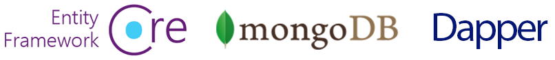

# ABP Документация

ABP Framework это полная **инфраструктура** основанная на **ASP.NET Core** для создания **современных веб приложений** и **APIs** следуя **лучшим практикам** и методам разработки программного обеспечения и **новейшим технологиям**.

## Начиная
 
* [Краткое руководство](Tutorials/Todo/Index.md) представляет собой состоящее из одной части краткое руководство по созданию простого приложения с помощью ABP Framework. Начните с данного руководства если вы хотите быстро понять как работает ABP.
* [с чего начать](Getting-Started.md) это руководство можно использовать для создания и запуска решений на основе ABP с различными параметрами и деталями. 
* [Руководство по разработке веб приложения](Tutorials/Part-1.md) эта часть представляет собой полное руководство по разработке полнофункционального веб-приложения со всеми аспектами реального решения.  

### Варианты фреймворков пользовательского интерфейса

### Варианты провайдеров баз данных

## Изучение документации 

ABP имеет **исчерпывающую документацию**, которая не только объясняет структуру ABP, но также включает **руководства** и **примеры** чтобы помочь вам в создании **поддерживаемого решения** путем ознакомления и обсуждения общих **принципов разработки программного обеспечения и лучших практик**. 

### Архитектура 

ABP предлагает полную, модульную и многоуровневую архитектуру программного обеспечения, основанную на принципах и шаблонах [Domain Driven Design](Domain-Driven-Design.md). Он также предоставляет необходимую инфраструктуру для реализации этой архитектуры. 

* Посмотрите [Модульность](Module-Development-Basics.md) документ, поможет понять модульную систему. 
* [Внедрение в Domain Driven Design](Domain-Driven-Design-Implementation-Guide.md) Документ является исчерпывающим руководством для тех, кто хочет понять и внедрить DDD. 
* [Микросервисная архитектура](Microservice-Architecture.md)В документе объясняется, как ABP помогает создать решение для микросервисов. 

### Инфраструктура 

ABP предоставляет множество функций для упрощения реализации реальных сценариев, таких как [Event Bus](Event-Bus.md), [Background Job System](Background-Jobs.md), (Background-Jobs.md), [Audit Logging](Audit-Logging.md), [Хранение BLOB-объектов] (Blob-Storing.md), [Data Seeding](Data-Seeding.md), [Data Filtering](Data-Filtering.md).

### Cross Cutting Concerns

ABP также упрощает (и даже автоматизирует, где это возможно) сквозные задачи и общие нефункциональные требования, такие как [Exception Handling](Exception-Handling.md), [Validation](Validation.md), [Authorization](Authorization.md), [Localization](Localization.md), [Caching](Caching.md), [Dependency Injection](Dependency-Injection.md), [Setting Management](Settings.md), etc. 

### Модули приложений 

Модули приложений предоставляют готовые функциональные возможности приложений; 

* [**Account**](Modules / Account.md): предоставляет пользовательский интерфейс для управления учетной записью и позволяет пользователю войти / зарегистрироваться в приложении.
* **[Identity](Modules/Identity.md)**: управляет организационными подразделениями, ролями, пользователями и их разрешениями на основе библиотеки Microsoft Identity.
* [**IdentityServer**] (Modules/IdentityServer.md): интегрируется с IdentityServer4.
* [**Tenant Management**] (Modules/Tenant-Management.md): управляет тенантами для [multi-tenant](Multi-Tenancy.md) (SaaS) приложения. 

Посмотрите [Application Modules](Modules/Index.md) документ для всех готовых модулей. 

### Стартовые шаблоны

Это [Стартовые шаблоны](Startup-Templates/Index.md) являются предварительно созданными шаблонами решений Visual Studio. Вы можете создать собственное решение на основе этих шаблонов, чтобы **сразу же начать разработку**. 

## ABP Сообщество

### Исходный код

Смотрите [Исходный код](https://github.com/abpframework). ABP размещенный на GitHub.

### Сайт ABP сообщества

[ABP Сообщество](https://community.abp.io/) на этом сайте публикуются статьи и обмениваются знаниями о ABP Framework. Вы также можете создавать контент для сообщества! 

### Блог

Прейдите по ссылке [ABP Blog](https://blog.abp.io/) чтобы узнавать о последних событиях в структуре ABP. 

### Примеры

Посмотрите [Простые проекты](Samples/Index.md) собранные с использованием ABP Framework. 

### Хотите внести свой вклад? 

ABP - это проект с открытым исходным кодом, управляемый сообществом. См. [Руководство по вкладу](Contribution/Index.md), если вы хотите стать частью этого проекта. 
