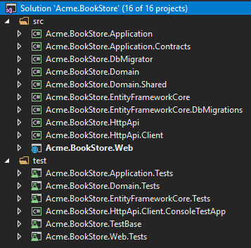
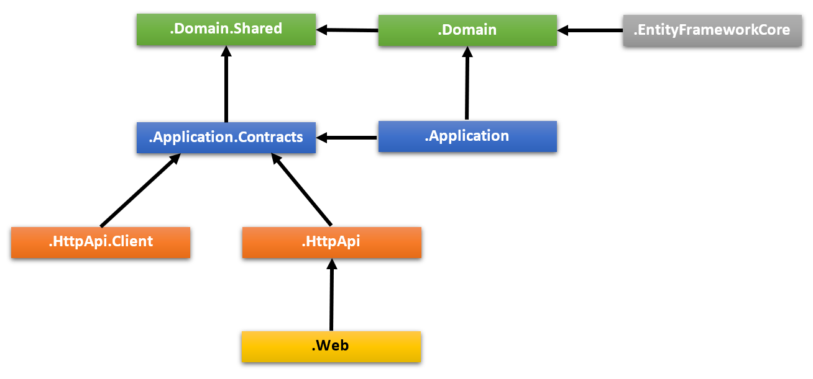
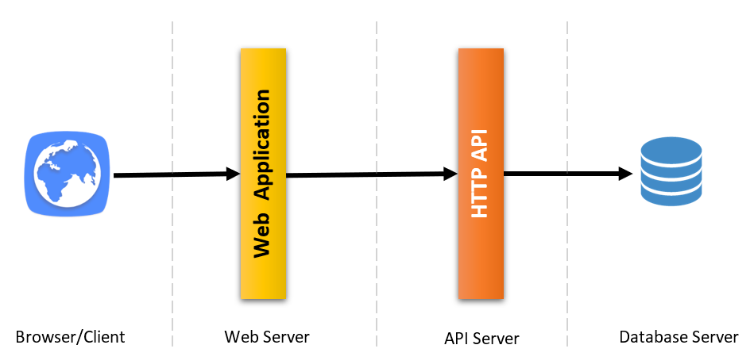
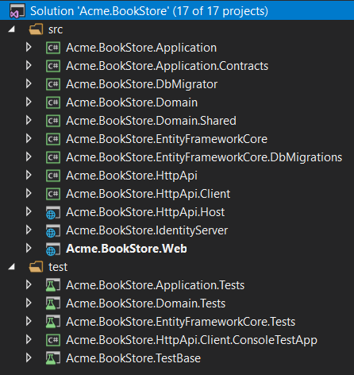
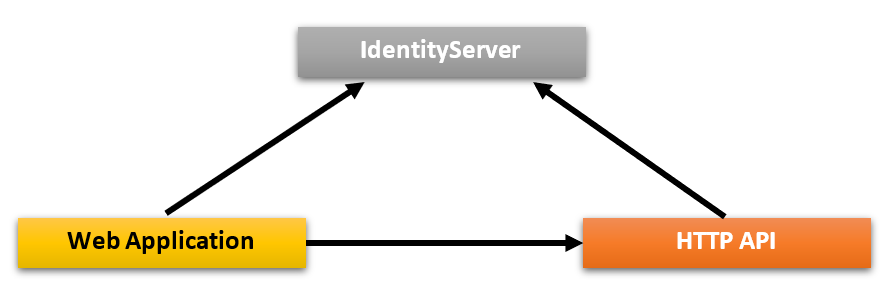
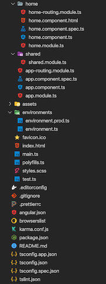
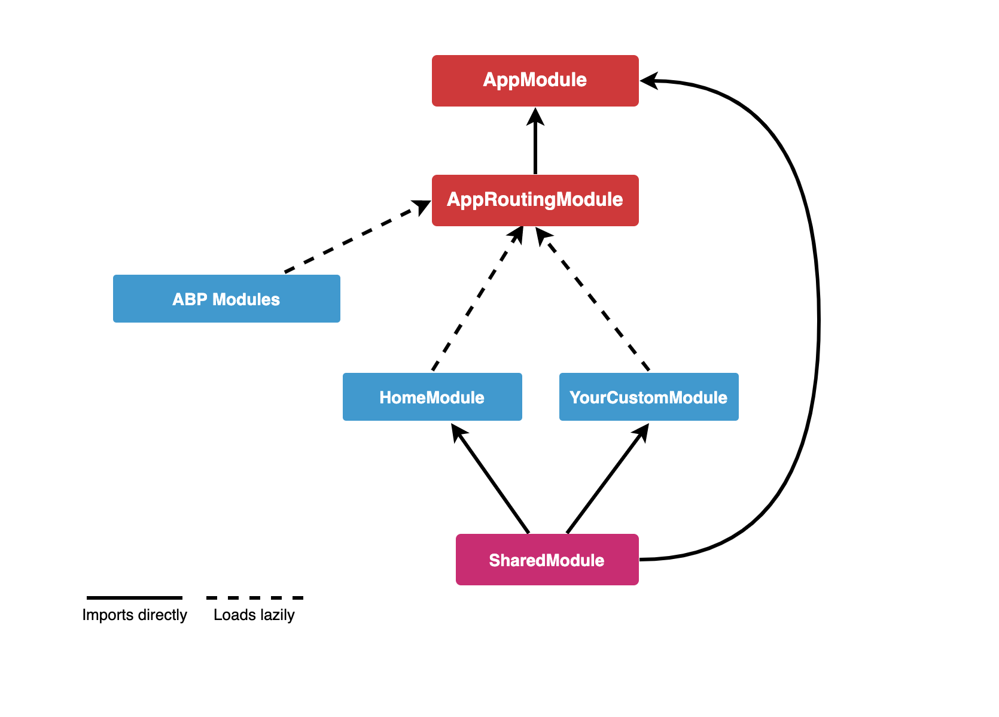
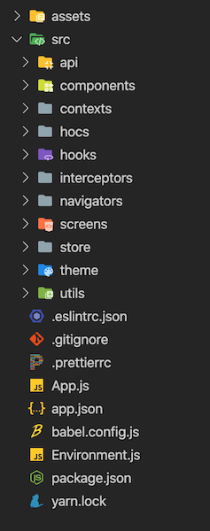
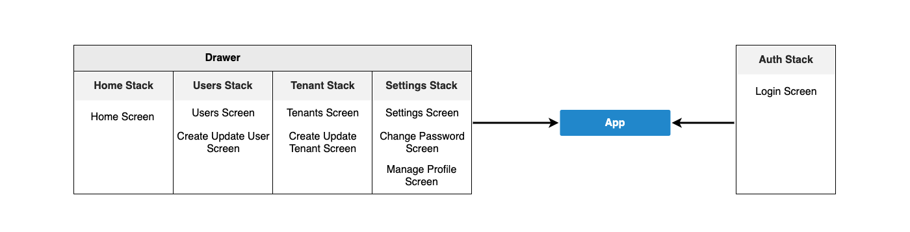
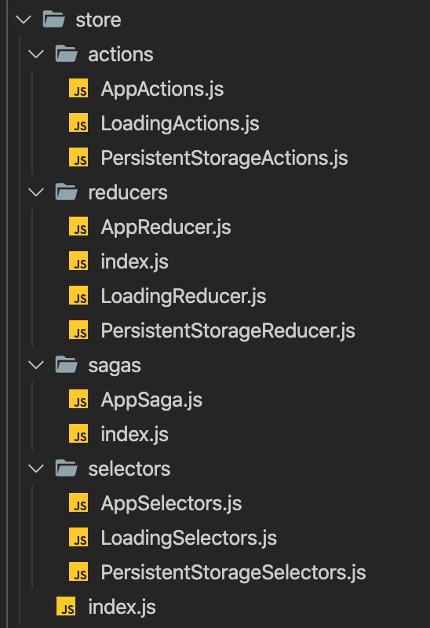

# Стартовый iаблон приложения

## Вступление 


Этот шаблон обеспечивает многоуровневую структуру приложения, основанную на практике [Domain Driven Design](../Domain-Driven-Design.md) (DDD).

В этом документе подробно объясняется **структура решения** и проекты. Если вы хотите начать быстро, следуйте приведенным ниже инструкциям: 

* [The getting started document](../Getting-Started-With-Startup-Templates.md) объясняет, как создать новое приложение за несколько минут. 
* [The application development tutorial](../Tutorials/Part-1) пошаговая разработка приложения. 

## С чего начать? 

Вы можете использовать [ABP CLI](../CLI.md) для создания нового проекта с использованием этого стартового шаблона. Или вы можете напрямую создать и загрузить шаблон на странице [Начало работы](https://abp.io/get-started). Далее используется подход CLI. 

Сначала установите ABP CLI, если вы еще не устанавливали его: 

````bash
dotnet tool install -g Volo.Abp.Cli
````
Затем используйте команду `abp new` в пустой папке, чтобы создать новое решение: 

````bash
abp new Acme.BookStore -t app
````

* `Acme.BookStore` это имя решения, например *YourCompany.YourProduct*. Вы можете использовать одноуровневое, двухуровневое или трехуровневое именование. 
* В этом примере указано имя шаблона (`-t` or `--template` option). Однако, `app`  уже является шаблоном по умолчанию, если вы его не укажете. 

### Выберете фреймворк пользовательского интерфейса

Этот шаблон предоставляет несколько фреймворков пользовательского интерфейса: 

* `mvc`: Пользовательский интерфейс ASP.NET Core MVC с Razor Pages (по умолчанию) 
* `blazor`: Blazor UI
* `angular`: Angular UI

Используйте параметр -u или --ui, чтобы указать конкретный фреймворк пользовательского интерфейса: 

````bash
abp new Acme.BookStore -u angular
````

### Укажите провайдера базы данных

Поддерживаемые типы провайдеров базы данных:

- `ef`: Entity Framework Core (по умолчанию)
- `mongodb`: MongoDB

Используйте опцию `-d` (или `--database-provider`) для указания конкретного типа провайдера базы данных:

````bash
abp new Acme.BookStore -d mongodb
````

### Укажите платформу мобильного приложения 

Этот шаблон поддерживает следующие платформы мобильных приложений:

- `react-native`: React Native

Используйте опцию `-m` (or `--mobile`) для указания конкретной платформы мобильного приложения:

````bash
abp new Acme.BookStore -m react-native
````

Если опция не указана, мобильное приложение создано не будет.

## Структура решения

В зависимости от указанных вами вариантов вы можете получить различную структуру решения.

### Структура по умолчанию

Если вы не укажете никаких дополнительных опций, у вас будет решение, подобное показанному ниже:



Проекты организованы в папки `src` и `test`. Папка `src` содержит фактическое приложение, которое разбито на уровни на основе принципов [DDD](../Domain-Driven-Design.md), как упоминалось ранее.

На схеме ниже показаны уровни и зависимости приложения от проекта:



Каждый раздел ниже объясняет связанный проект и его зависимости.

#### Слой/Проект .Domain.Shared

Этот проект содержит константы, перечисления и другие объекты, которые на самом деле являются частью уровня домена, но должны использоваться всеми слоями/проектами в решении.

Перечисление `BookType` и класс `BookConsts` (которые могут иметь некоторые постоянные поля для сущности `Book`, например `MaxNameLength`) являются хорошими кандидатами для этого проекта.

* Этот проект не зависит от других проектов в решении. Все остальные проекты прямо или косвенно зависят от этого.

#### Слой/Проект .Domain

Это доменный слой решения. В основном он содержит [entities, aggregate roots](../Entities.md), [службы домена] (../ Domain-Services.md), [domain services](../Domain-Services.md), [value objects](../Value-Objects.md), [repository interfaces](../Repositories.md) и другие объекты домена.

Сущность `Book`, доменная служба `BookManager` и интерфейс `IBookRepository` - хорошие элементы для этого проекта.

* Зависит от `.Domain.Shared`, потому что он использует константы, перечисления и другие объекты, определенные в этом проекте.

#### Слой/Проект .Application.Contracts

Этот проект в основном содержит [application service](../Application-Services.md) **интерфейсы** и [Data Transfer Objects](../Data-Transfer-Objects.md) (DTO) уровня приложения. Он существует для разделения интерфейса и реализации прикладного уровня. Таким образом, проект интерфейса может быть предоставлен клиентам как пакет контракта.

Интерфейс `IBookAppService` и класс `BookCreationDto` являются хорошими кандидатами для этого проекта.

* Зависит от `.Domain.Shared`, потому что он может использовать константы, перечисления и другие общие объекты этого проекта в интерфейсах служб приложений и DTO.

#### Слой/Проект .Application

Данный проект [application service](../Application-Services.md) **Имплементирует** интерфейсы определенных в проекте `.Application.Contracts`.

Класс `BookAppService` - хороший кандидат для этого проекта.

* Зависит от проекта `.Application.Contracts`, чтобы иметь возможность реализовывать интерфейсы и использовать DTO.

* Зависит от проекта `.Domain`, чтобы иметь возможность использовать объекты домена (сущности, интерфейсы репозитория ... и т. Д.) Для выполнения логики приложения.

#### Слой/Проект .EntityFrameworkCore

Это проект интеграции с EF Core. Он определяет `DbContext` и реализует интерфейсы репозитория, определенные в проекте .Domain.

* Зависит от проекта `.Domain`, чтобы иметь возможность ссылаться на сущности и интерфейсы репозитория. 

>Этот проект доступен, только если вы используете EF Core в качестве поставщика базы данных. Если вы выберете другого поставщика базы данных, его имя будет другим.

#### Слой/Проект .EntityFrameworkCore.DbMigrations

Содержит миграции базы данных EF Core для решения. Он имеет отдельный `DbContext`, предназначенный для управления миграциями.

ABP - это модульный фреймворк с идеальным дизайном, каждый модуль имеет свой собственный класс DbContext. Здесь в игру вступает миграция `DbContext`, которая объединяет все конфигурации` DbContext` в единую модель для поддержки единой схемы базы данных. Для более сложных сценариев у вас может быть несколько баз данных (каждая содержит одну или несколько таблиц модулей) и множественный перенос `DbContext`s (каждая поддерживает свою схему базы данных).

Обратите внимание, что миграция `DbContext` используется только для миграции базы данных и *не используется в runtime*.

* Зависит от проекта `.EntityFrameworkCore`, поскольку он повторно использует конфигурацию, определенную для` DbContext` приложения.

> Этот проект доступен, только если вы используете EF Core в качестве поставщика базы данных.
>
> Смотрите [Entity Framework Core Migrations Guide](../Entity-Framework-Core-Migrations.md), чтобы понять этот проект более подробно.

#### Слой/Проект .DbMigrator 

Это консольное приложение, которое упрощает выполнение миграции базы данных в средах разработки и на боевом сервере. Когда вы запускаете это приложение, оно;

* При необходимости создает базу данных.
* Применяет незавершенные миграции базы данных.
* При необходимости засевает исходные данные.

> У этого проекта есть собственный файл `appsettings.json`. Итак, если вы хотите изменить строку подключения к базе данных, не забудьте изменить и этот файл.

На этом этапе особенно важен инициализация исходных данных. ABP имеет модульную инфраструктуру с иначальной структурой данных. См. [its documentation](../Data-Seeding.md) для получения дополнительной информации о заполнении данных.

Хотя создание базы данных и применение миграции необходимо только для реляционных баз данных, эти проекты появляются, даже если вы выбираете поставщика базы данных NoSQL (например, MongoDB). В этом случае он по-прежнему сохраняет исходную структуру, необходимые для приложения.

* Зависит от `.EntityFrameworkCore.DbMigrations` проекта (для EF Core), поскольку ему требуется доступ к миграциям.
* Зависит от проекта `.Application.Contracts`, чтобы иметь возможность доступа к определениям разрешений, поскольку начальная инициализация данных требует разрешения в качестве роли администратора.

#### Слой/Проект .HttpApi

Этот проект используется для определения ваших контроллеров API. 

В большинстве случаев вам не нужно вручную определять контроллеры API, поскольку функция ABP [Auto API Controllers](../API/Auto-API-Controllers.md) создает их автоматически на основе слоя Application вашего приложения. Однако, если вам нужно написать контроллеры API, это лучшее место для этого. 

* Зависит от проекта `.Application.Contracts`, чтобы иметь возможность внедрять интерфейсы служб приложения. 

#### Слой/Проект .HttpApi.Client

Это проект, который определяет клиентские прокси C# для использования HTTP API решения. Вы можете поделиться этой библиотекой со сторонними клиентами, чтобы они могли легко использовать ваши HTTP API в своих приложениях Dotnet (для других типов приложений они по-прежнему могут использовать ваши API вручную или с помощью инструмента на своей собственной платформе) 

В большинстве случаев вам не нужно вручную создавать клиентские прокси на C# благодаря функции ABP [Dynamic C# API Clients](../API/Dynamic-CSharp-API-Clients.md). 

Проект `.HttpApi.Client.ConsoleTestApp` - это консольное приложение, созданное для демонстрации использования клиентских прокси. 

* Зависит от проекта `.Application.Contracts`, чтобы иметь возможность совместно использовать одни и те же интерфейсы служб приложений и DTO с удаленной службой. 

> Вы можете удалить этот проект и зависимости, если вам не нужно создавать клиентские прокси C# для ваших API. 

#### Проект .Web

Этот проект содержит пользовательский интерфейс (UI) приложения, если вы используете пользовательский интерфейс ASP.NET Core MVC. Он содержит страницы Razor, файлы JavaScript, файлы CSS, изображения и так далее ... 

Этот проект содержит основной файл `appsettings.json`, который содержит строку подключения и другую конфигурацию приложения. 

* Зависит от `.HttpApi`, поскольку слой пользовательского интерфейса должен использовать API и интерфейсы служб приложений решения. 

> Если вы проверите исходный код файла `.Web.csproj`, вы увидите ссылки на проекты` .Application` и `.EntityFrameworkCore.DbMigrations`. 
>
> Эти ссылки на самом деле не нужны при кодировании слоя пользовательского интерфейса, поскольку уровень пользовательского интерфейса обычно не зависит от реализации EF Core или слоя приложения. Эти стартовые шаблоны готовы для раздельного развертывания, когда когда API размещается на отдельном сервере, а не на совместно со слоем пользовательского интерфейса. 
>
> Однако, если вы не укажете опцию `--tiered`, эти ссылки будут в проекте .Web, чтобы иметь возможность размещать веб-слои, API и уровни приложений в одной конечной точке приложения. 
>
> Это дает вам возможность использовать объекты домена и репозитории на уровне представления. Хотя и согласно DDD, это считается плохой практикой. 

#### Проекты Test

В решении есть несколько тестовых проектов, по одному для каждого слоя: 

* `.Domain.Tests` используется для тестирования слоя домена.
* `.Application.Tests` используется для тестирования слоя приложения.
* `.EntityFrameworkCore.Tests` используется для тестирования конфигурации EF Core и настраиваемых репозиториев.
* `.Web.Tests` используется для тестирования пользовательского интерфейса (если вы используете пользовательский интерфейс ASP.NET Core MVC).
* `.TestBase` - это базовый (общий) проект для всех тестов. 

Кроме того, `.HttpApi.Client.ConsoleTestApp` - это консольное приложение (не автоматизированный тестовый проект), демонстрирующее использование HTTP API из приложения .NET. 

Тестовые проекты подготовлены к интеграционному тестированию;

* Они полностью интегрирован в структуру ABP и все службы в вашем приложении.
* Они использует базу данных SQLite в памяти для EF Core. Для MongoDB используется библиотека [Mongo2Go](https://github.com/Mongo2Go/Mongo2Go).
* Авторизация отключена, поэтому любое приложение-сервис можно легко использовать в тестах. 

Вы по-прежнему можете создавать модульные тесты для своих классов, которые будет сложнее написать (потому что вам нужно будет подготовить mock/fake объекты), но быстрее запустить (потому что он тестирует только один класс и пропускает весь процесс инициализации). 

#### Как запустить? 

Установите `.Web` в качестве запускаемого проекта и запустите приложение. Имя пользователя по умолчанию - `admin`, пароль - `1q2w3E*`. 

Смотрите более подробно [Getting Started With the ASP.NET Core MVC Template](../Getting-Started-AspNetCore-MVC-Template.md).

### Многоуровневая/Многослойная структура 

Если вы выбрали пользовательский интерфейс ASP.NET Core и указали параметр --tiered, созданное решение будет многоуровневым. Назначение многоуровневой структуры - иметь возможность **развертывать веб-приложение и HTTP API на разных серверах**: 



* Браузер отображает ваш пользовательский интерфейс, выполняя HTML, CSS и JavaScript.
* Веб-сервер содержат статические файлы пользовательского интерфейса (CSS, JavaScript, изображения и т. Д.) И динамические компоненты (например, страницы Razor). Он выполняет HTTP-запросы к серверу API для выполнения бизнес-логики приложения.
* Сервер API содержит HTTP API, которые затем используют уровни приложения и домена приложения для выполнения бизнес-логики.
* Наконец, сервер баз данных размещает вашу базу данных. 

Таким образом, получившееся решение допускает четырехуровневое развертывание по сравнению с трехуровневым развертыванием структуры по умолчанию, описанной ранее. 

> Если вам действительно не нужно такое четырехуровневое развертывание, рекомендуется использовать структуру по умолчанию, которую проще разрабатывать, развертывать и поддерживать. 

Структура решения показана ниже: 



В отличие от структуры по умолчанию, в игру вступают два новых проекта: `.IdentityServer` и `.HttpApi.Host`.

#### Проект .IdentityServer

Этот проект используется в качестве сервера аутентификации для других проектов. Проект `.Web` использует аутентификацию OpenId Connect для получения идентификаторов и токенов доступа для текущего пользователя с IdentityServer. Затем использует токен доступа для вызова HTTP API-сервера. Сервер HTTP API использует аутентификацию токена-носителя для получения утверждений от токена доступа для авторизации текущего пользователя. 



ABP использует платформу [IdentityServer4](https://identityserver.io/) с открытым исходным кодом для аутентификации между приложениями. См. [Документацию IdentityServer4](http://docs.identityserver.io) для получения подробной информации о протоколе IdentityServer4 и OpenID Connect. 

У него есть собственный `appsettings.json`, который содержит соединение с базой данных и другие конфигурации. 

#### Проект .HttpApi.Host

Этот проект представляет собой приложение, в котором размещен API решения. У него есть собственный `appsettings.json`, который содержит соединение с базой данных и другие конфигурации. 

#### Проект .Web

Как и структура по умолчанию, этот проект содержит пользовательский интерфейс (UI) приложения. Он содержит razor страницы, файлы JavaScript, файлы стилей, изображения и т. Д. 

Этот проект содержит файл `appsettings.json`, но на этот раз у него нет строки подключения, потому что он никогда не подключается к базе данных. Вместо этого он в основном содержит конечную точку удаленного сервера API и сервера аутентификации. 

#### Предварительные требования 

* [Redis](https://redis.io/): Приложения используют Redis как распределенный кеш. Вам необходимо установить и запустить Redis. 

#### Как запустить? 

Вы должны запустить приложение в указанном порядке:

* Сначала запустите `.IdentityServer`, так как от него зависят другие приложения.
* Затем запустите `.HttpApi.Host`, поскольку он используется приложением` .Web`.
* Наконец, вы можете запустить проект `.Web` и войти в приложение (используя `admin` в качестве имени пользователя и `1q2w3E*` в качестве пароля). 

### Angular UI

Если вы выберете `Angular` в качестве UI-фреймворка (используя параметр `-u angular`), решение будет разделено на две папки: 

* `angular` Папка содержит приложение Angular UI, клиентский код для браузера. 
* `aspnet-core` папка содержит решение ASP.NET Core, бекенд.

На стороне сервера аналогично описанному выше решению. Проект `*.HttpApi.Host` обслуживает API, а приложение` Angular` использует его.

Структура папок приложения Angular выглядит следующим образом: 



Каждый из коммерческих модулей ABP представляет собой пакет NPM. Некоторые модули ABP добавляются как зависимость в `package.json`. Эти модули устанавливаются вместе со своими зависимостями. Чтобы увидеть все пакеты ABP, вы можете запустить следующую команду в папке `angular`: 

```bash
yarn list --pattern abp
```

Структура модуля Angular приложения: 



#### AppModule

`AppModule` - корневой модуль приложения. Некоторые из модулей ABP и некоторые важные модули импортированы в `AppModule`. 

ABP Config modules также были импортированы в `AppModule` и могут быть инициализированны с помощью lazy-loadable ABP modules. 

#### AppRoutingModule

There are lazy-loadable ABP modules in the `AppRoutingModule` as routes.

> Paths of ABP Modules should not be changed.

You should add `routes` property in the `data` object to add a link on the menu to redirect to your custom pages.

```js
{
   path: 'dashboard',
   loadChildren: () => import('./dashboard/dashboard.module').then(m => m.DashboardModule),
   canActivate: [AuthGuard, PermissionGuard],
   data: {
      routes: {
         name: 'ProjectName::Menu:Dashboard',
         order: 2,
         iconClass: 'fa fa-dashboard',
         requiredPolicy: 'ProjectName.Dashboard.Host'
      } as ABP.Route
   }
}
```
In the above example;
*  If the user is not logged in, AuthGuard blocks access and redirects to the login page.
*  PermissionGuard checks the user's permission with `requiredPolicy` property of the `rotues` object. If the user is not authorized to access the page, the 403 page appears.
*  `name` property of `routes` is the menu link label. A localization key can be defined .
*  `iconClass` property of `routes` object is the menu link icon class.
*  `requiredPolicy` property of `routes` object is the required policy key to access the page.

After the above `routes` definition, if the user is authorized, the dashboard link will appear on the menu.

#### Shared Module

The modules that may be required for all modules have imported to the `SharedModule`. You should import the `SharedModule` to all modules.

See the [Sharing Modules](https://angular.io/guide/sharing-ngmodules) document.

#### Environments

The files under the `src/environments` folder has the essential configuration of the application.

#### Home Module

Home module is an example lazy-loadable module that loads on the root address of the application.

#### Styles

The required style files added to `styles` array in the `angular.json`. `AppComponent` loads some style files lazily via `LazyLoadService` after the main bundle is loaded to shorten the first rendering time.

#### Testing

You should create your tests in the same folder as the file file you want to test.

See the [testing document](https://angular.io/guide/testing).

#### Depended Packages

* [NG Bootstrap](https://ng-bootstrap.github.io/) is used as UI component library.
* [NGXS](https://www.ngxs.io/) is used as state management library.
* [angular-oauth2-oidc](https://github.com/manfredsteyer/angular-oauth2-oidc) is used to support for OAuth 2 and OpenId Connect (OIDC).
* [Chart.js](https://www.chartjs.org/) is used to create widgets.
* [ngx-validate](https://github.com/ng-turkey/ngx-validate) is used for dynamic validation of reactive forms.

### React Native

if `-m react-native` option is spesified in new project command, the solution includes the [React Native](https://reactnative.dev/) application in the `react-native` folder.

The server-side is similar to the solution described above. `*.HttpApi.Host` project serves the API, so the React Native application consumes it.

The React Native application was generated with [Expo](https://expo.io/). Expo is a set of tools built around React Native to help you quickly start an app and, while it has many features.

React Native application folder structure as like below:



* `App.js` is bootstrap component of the application.
* `Environment.js` file has the essential configuration of the application. `prod` and `dev` configurations defined in this file. 
* [Contexts](https://reactjs.org/docs/context.html) are created in the `src/contexts` folder.
* [Higher order components](https://reactjs.org/docs/higher-order-components.html) are created in the`src/hocs` folder.
* [Custom hooks](https://reactjs.org/docs/hooks-custom.html#extracting-a-custom-hook) are created in the`src/hooks`.
* [Axios interceptors](https://github.com/axios/axios#interceptors) are created in the `src/interceptors` folder.
* Utility functions are exported from `src/utils` folder.

#### Components

Components that can be used on all screens are created in the `src/components` folder. All components have created as a function that able to use [hooks](https://reactjs.org/docs/hooks-intro.html).

#### Screens



Screens are created by creating folders that separate their names in the `src/screens` folder. Certain parts of some screens can be split into components.

Each screen is used in a navigator in the `src/navigators` folder.

#### Navigation

[React Navigation](https://reactnavigation.org/) is used as a navigation library. Navigators are created in the `src/navigators`. A [drawer](https://reactnavigation.org/docs/drawer-based-navigation/) navigator and several [stack](https://reactnavigation.org/docs/hello-react-navigation/#installing-the-stack-navigator-library) navigators have created in this folder. See the [above diagram](#screens) for navigation structure.

#### State Management

[Redux](https://redux.js.org/) is used as state management library. [Redux Toolkit](https://redux-toolkit.js.org/) library is used as a toolset for efficient Redux development.

Actions, reducers, sagas, selectors are created in the `src/store` folder. Store folder as like below:



* [**Store**](https://redux.js.org/basics/store) is defined in the `src/store/index.js` file.
* [**Actions**](https://redux.js.org/basics/actions/) are payloads of information that send data from your application to your store.
* [**Reducers**](https://redux.js.org/basics/reducers) specify how the application's state changes in response to actions sent to the store. 
* [**Redux-Saga**](https://redux-saga.js.org/) is a library that aims to make application side effects (i.e. asynchronous things like data fetching and impure things like accessing the browser cache) easier to manage. Sagas are created in the `src/store/sagas` folder.
* [**Reselect**](https://github.com/reduxjs/reselect) library is used to create memoized selectors. Selectors are created in the `src/store/selectors` folder.

#### APIs

[Axios](https://github.com/axios/axios) is used as an HTTP client library. An Axios instance has exported from  `src/api/API.js` file to make HTTP calls with the same config. `src/api` folder also has the API files that have been created for API calls.

#### Theming

[Native Base](https://nativebase.io/) is used as UI components library. Native Base components can customize easily. See the [Native Base customize](https://docs.nativebase.io/Customize.html#Customize) documentation. We followed the same way.

* Native Base theme variables are in the `src/theme/variables` folder.
* Native Base component styles are in the `src/theme/components` folder. These files have been generated with Native Base's `ejectTheme` script.
* Styles of components override with the files under the `src/theme/overrides` folder.

#### Testing

Unit tests will be created.

See the [Testing Overview](https://reactjs.org/docs/testing.html) document.

#### Depended Libraries

* [Native Base](https://nativebase.io/) is used as UI components library.
* [React Navigation](https://reactnavigation.org/) is used as navigation library.
* [Axios](https://github.com/axios/axios) is used as HTTP client library.
* [Redux](https://redux.js.org/) is used as state management library.
* [Redux Toolkit](https://redux-toolkit.js.org/) library is used as a toolset for efficient Redux development.
* [Redux-Saga](https://redux-saga.js.org/) is used to manage asynchronous processes.
* [Redux Persist](https://github.com/rt2zz/redux-persist) is used as state persistance.
* [Reselect](https://github.com/reduxjs/reselect) is used to create memoized selectors.
* [i18n-js](https://github.com/fnando/i18n-js) is used as i18n library.
* [expo-font](https://docs.expo.io/versions/latest/sdk/font/) library allows loading fonts easily.
* [Formik](https://github.com/jaredpalmer/formik) is used to build forms.
* [Yup](https://github.com/jquense/yup) is used for form validations.

## Social / External Logins

If you want to configure social/external logins for your application, please follow the [Social/External Logins](../Authentication/Social-External-Logins.md) document.

## What's Next?

- [The getting started document](../Getting-Started.md) explains how to create a new application in a few minutes.
- [The application development tutorial](../Tutorials/Part-1.md) explains step by step application development.
