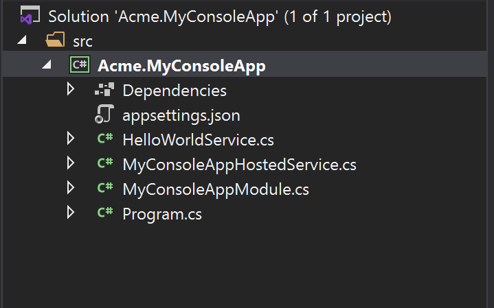

# Шаблон консольного приложения 

Этот шаблон используется для создания проекта минималистичного консольного приложения. 

## С чего начать?

Сперва установите [ABP CLI](../CLI.md) если вы установили ранее:

````bash
dotnet tool install -g Volo.Abp.Cli
````

Используйте команду `abp new` в пустом каталоге для создания нового решения:

````bash
abp new Acme.MyConsoleApp -t console
````

`Acme.MyConsoleApp` это имя решения, например *YourCompany.YourProduct*. Вы можете использовать одноуровневое, двухуровневое или трехуровневое именование. 

## Структура решения 

После того, как вы воспользуетесь указанной выше командой для создания решения, у вас будет решение, подобное показанному ниже: 



* `HelloWorldService` - это пример службы, которая реализует интерфейс `ITransientDependency` для регистрации этой службы в системе [dependency injection](../Dependency-Injection.md). 