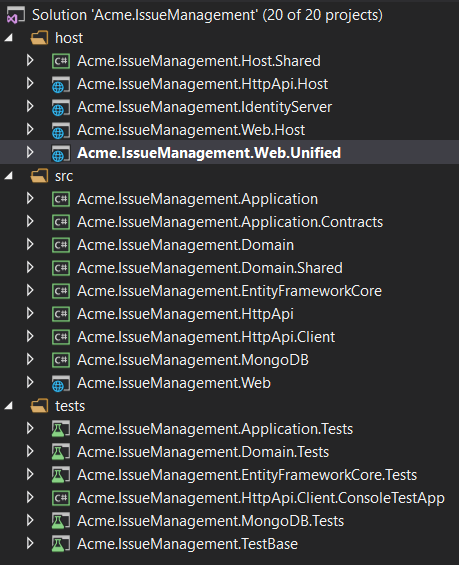
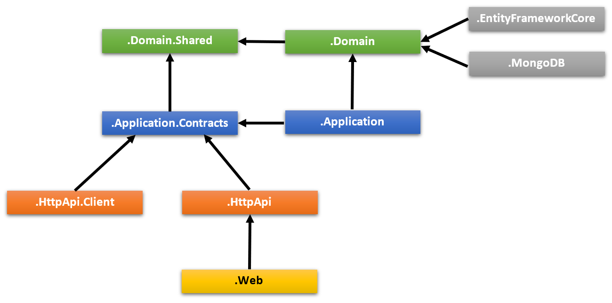
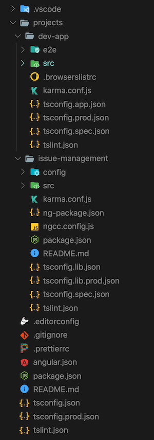
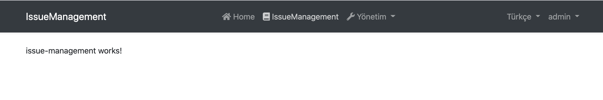

# Стартовый шаблон модуля

Этот шаблон можно использовать для создания **повторно используемого [application module](../Modules/Index.md)** на основе [лучших практик и соглашений по разработке модулей](../Best-Practices/Index.md). Он также подходит для создания **микросервисов** (с пользовательским интерфейсом или без него). 

## С чего начать?


Вы можете использовать [ABP CLI](../CLI.md) для создания нового проекта с использованием этого шаблона запуска. Кроме того, вы можете напрямую создать и загрузить со страницы [Get Started](https://abp.io/get-started). Здесь используется подход CLI.

Сначала установите ABP CLI, если вы еще не устанавливали его: 

```bash
dotnet tool install -g Volo.Abp.Cli
```

Затем используйте команду `abp new` в пустой папке, чтобы создать новое решение: 

```bash
abp new Acme.IssueManagement -t module
```

- `Acme.IssueManagement` - это имя решения, например *YourCompany.YourProduct*. Вы можете использовать одноуровневое, двухуровневое или трехуровневое именование. 

### Укажите UI Framework 

Этот шаблон предоставляет несколько фреймворков пользовательского интерфейса: 

* `mvc`: пользовательский интерфейс ASP.NET Core MVC с Razor Pages (по умолчанию)
* `blazor`: пользовательский интерфейс Blazor.
* `angular`: пользовательский интерфейс Angular 

Используйте параметр `-u` или `--ui`, чтобы указать структуру пользовательского интерфейса: 

````bash
abp new Acme.IssueManagement -t module -u angular
````

### Без пользовательского интерфейса

По умолчанию шаблон поставляется с пользовательским интерфейсом MVC. Вы можете использовать параметр --no-ui, чтобы не включать слой пользовательского интерфейса. 

````bash
abp new Acme.IssueManagement -t module --no-ui
````

## Solution Structure

В зависимости от указанных вами вариантов вы получите ту или иную структуру решения. Если вы не укажете никаких опций, у вас будет решение, подобное показанному ниже: 



Проекты организованы в виде папок `src`, `test` и `host`: 

* Папка `src` содержит фактический модуль, который разбит на слои на основе принципов [DDD](../ Domain-Driven-Design.md).
* Папка `test` содержит модульные и интеграционные тесты.
* Папка `host` содержит приложения с различными конфигурациями, чтобы продемонстрировать, как разместить модуль в приложении. Они не являются частью модуля, но полезны при разработке. 

На диаграмме ниже показаны уровни и зависимости модуля от проекта: 



Каждый раздел ниже объясняет связанный проект и его зависимости. 

### .Domain.Shared Project

Этот проект содержит константы, перечисления и другие объекты, которые на самом деле являются частью уровня домена, но должны использоваться всеми слоями/проектами в решении.

enum `IssueType` и класс `IssueConsts` (которые могут иметь некоторые постоянные поля для сущности Issue, например MaxTitleLength) являются хорошими кандидатами для этого проекта.

- Этот проект не зависит от других проектов в решении. Все остальные проекты прямо или косвенно зависят от этого.

### .Domain Project

Это доменный слой решения. В основном он содержит  [entities, aggregate roots](../Entities.md), [domain services](../Domain-Services.md), типы значений, [repository interfaces](../Repositories.md) и другие объекты домена.

Сущность `Issue`, доменная служба `IssueManager` и интерфейс `IIssueRepository` являются хорошими кандидатами для этого проекта.

- Зависит от `.Domain.Shared`, потому что он использует константы, перечисления и другие объекты, определенные в этом проекте. 

### .Application.Contracts Project

Этот проект в основном содержит [службу приложения] [application service](../Application-Services.md) **interfaces** и [Data Transfer Objects](../Data-Transfer-Objects.md) (DTO) уровня приложения. Он существует для разделения интерфейса и реализации прикладного уровня. Таким образом, проект интерфейса может быть предоставлен клиентам как пакет контракта.

Интерфейс `IIssueAppService` и класс `IssueCreationDto` являются хорошими кандидатами для этого проекта.


- Зависит от `.Domain.Shared`, потому что он может использовать константы, перечисления и другие общие объекты этого проекта в интерфейсах служб приложений и DTO.

### .Application Project

Этот проект содержит [application service](../Application-Services.md) **реализации** интерфейсов, определенных в проекте `.Application.Contracts`.

Класс `IssueAppService` - хороший кандидат для этого проекта.


- Зависит от проекта `.Application.Contracts`, чтобы иметь возможность реализовывать интерфейсы и использовать DTO.
- Зависит от проекта `.Domain`, чтобы иметь возможность использовать объекты домена (сущности, интерфейсы репозитория и т. д.) Для выполнения логики приложения. 

### .EntityFrameworkCore Project

Это проект интеграции для EF Core. Он определяет `DbContext` и реализует интерфейсы репозитория, определенные в проекте `.Domain`.

- Зависит от проекта `.Domain`, чтобы иметь возможность ссылаться на сущности и интерфейсы репозитория. 

> Вы можете удалить этот проект, если не хотите поддерживать EF Core для своего модуля. 

### .MongoDB Project

Это проект интеграции для MongoDB. 

- Зависит от проекта `.Domain`, чтобы иметь возможность ссылаться на сущности и интерфейсы репозитория. 

> Вы можете удалить этот проект, если не хотите поддерживать MongoDB для своего модуля. 

### Test Projects

В решении есть несколько тестовых проектов, по одному для каждого уровня:

- `.Domain.Tests` используется для тестирования уровня домена.
- `.Application.Tests` используется для тестирования уровня приложения.
- `.EntityFrameworkCore.Tests` используется для тестирования конфигурации EF Core и настраиваемых репозиториев.
- `.MongoDB.Tests` используется для тестирования конфигурации MongoDB и пользовательских репозиториев.
- `.TestBase` - это базовый (общий) проект для всех тестов.

Кроме того, `.HttpApi.Client.ConsoleTestApp` - это консольное приложение (не автоматизированный тестовый проект), демонстрирующее использование HTTP API из приложения Dotnet.

Подготовлены тестовые проекты к интеграционному тестированию;

- Он полностью интегрирован в структуру ABP и все службы в вашем приложении.
- Он использует базу данных SQLite в памяти для EF Core. Для MongoDB используется библиотека [Mongo2Go] (https://github.com/Mongo2Go/Mongo2Go).
- Авторизация отключена, поэтому любое приложение-сервис можно легко использовать в тестах.

Вы по-прежнему можете создавать модульные тесты для своих классов, которые будет сложнее написать (потому что вам нужно будет подготовить фиктивные/поддельные объекты), но быстрее запустить (потому что он тестирует только один класс и пропускает весь процесс инициализации).

> Тесты домена и приложений используют EF Core. Если вы удаляете интеграцию с EF Core или хотите использовать MongoDB для тестирования этих уровней, вам следует вручную изменить ссылки на проекты и зависимости модулей. 

### Host Projects

В решении есть несколько хост-приложений для запуска вашего модуля. Хост-приложения используются для запуска вашего модуля в полностью сконфигурированном приложении. Полезно при разработке. Хост-приложения включают в себя некоторые другие модули в дополнение к разрабатываемому модулю:

Хост-приложения поддерживают два типа сценариев. 

#### Единый (унифицированный) сценарий приложения

Если у вашего модуля есть UI, то приложение `.Web.Unified` используется для размещения UI и API в одной точке. У него есть собственный файл `appsettings.json` (который включает строку подключения к базе данных) и миграции базы данных EF Core.

Для приложения `.Web.Unified` существует единственная база данных с именем` YourProjectName_Unified` (например, *IssueManagement_Unified* в этом примере).

> Если вы выбрали опцию `--no-ui`, этого проекта не будет в вашем решении.

##### Как запустить?

Задайте `host/YourProjectName.Web.Unified` в качестве запускаемого проекта, запустите команду `Update-Database` для EF Core из консоли диспетчера пакетов и запустите приложение. Имя пользователя по умолчанию - admin, пароль - `1q2w3E*`.

#### Сценарий раздельного развертывания и баз данных

В этом сценарии есть три приложения;

* Приложение `.IdentityServer` - это сервер аутентификации, используемый другими приложениями. У него есть собственный `appsettings.json`, который содержит соединение с базой данных и другие конфигурации.
* `.HttpApi.Host` содержит HTTP API модуля. У него есть собственный `appsettings.json`, содержащий подключения к базе данных и другие конфигурации.
* `.Web.Host` размещает пользовательский интерфейс модуля. Этот проект содержит файл `appsettings.json`, но у него нет строки подключения, потому что он никогда не подключается к базе данных. Вместо этого он в основном содержит конечную точку удаленного сервера API и сервера аутентификации.

На диаграмме ниже показано соотношение приложений:


Проект `.Web.Host` использует аутентификацию OpenId Connect для получения идентификаторов и токенов доступа для текущего пользователя из `.IdentityServer`. Затем использует токен доступа для вызова `.HttpApi.Host`. Сервер HTTP API использует аутентификацию токена-носителя для получения утверждений от токена доступа для авторизации текущего пользователя. 

##### Подготовка перед запуском

* [Redis](https://redis.io/): приложения используют Redis в качестве распределенного кеша. Итак, вам необходимо установить и запустить Redis. 

##### Как запустить?

Вы должны запускать приложение в указанном порядке:

- Первым, запустите `.IdentityServer`, так как от него зависят другие приложения.
- Затем запустите файл `.HttpApi.Host`, поскольку он используется приложением` .Web.Host`.
- Наконец, вы можете запустить проект `.Web.Host` и войти в приложение, используя `admin` в качестве имени пользователя и `1q2w3E*` в качестве пароля. 

## UI

### Angular UI

Если вы выберете Angular в качестве UI-фреймворка (используя опцию -u angular), в решении будет папка с именем angular. Здесь находится код клиента. Когда вы откроете эту папку в IDE, структура папок будет выглядеть, как показано ниже: 



* _angular/projects/issue-management_ Папка содержит проект модуля Angular. 
* _angular/projects/dev-app_ Папка содержит приложение для разработки, которое запускает ваш модуль. 

На стороне сервера аналогично описанному выше решению. Проект `* .HttpApi.Host` обслуживает API, а демонстрационное приложение `Angular` использует его. Однако вам не нужно запускать проект `.Web.Host`. 

#### Как запустить приложение Angular в режиме разработки

Для разработки модуля вам понадобится запущенный проект `dev-app`. Итак, вот как мы можем запустить сервер разработки.

Для начала нам нужно установить зависимости: 

1. Откройте свой терминал в корневой папке, то есть в `angular`.
2. Выполните `yarn` или `npm install`.

Зависимости будут установлены, и некоторые из них являются модулями ABP, опубликованными как пакеты NPM. Чтобы увидеть все пакеты ABP, вы можете запустить следующую команду в папке angular: 

```bash
yarn list --pattern abp
```

> В npm нет эквивалента этой команды.

Модуль, который вы будете разрабатывать, зависит от двух из этих пакетов ABP: _@abp/ng.core_ и _@abp/ng.theme.shared_. Остальные модули ABP включены в _package.json_ из-за проекта dev-app.

После установки всех зависимостей выполните следующие действия для обслуживания вашего приложения для разработки: 

1. Убедитесь, что проекты `.IdentityServer` и` * .HttpApi.Host` запущены и работают.
2. Откройте ваш терминал в корневой папке, то есть в `angular`.
3. Запустите `yarn start` или` npm start`. 



Страница управления проблемами вначале пуста. Вы можете изменить содержимое в `IssueManagementComponent` по пути _angular/projects/issue-management/src/lib/issue-management.component.ts_ и заметить, что представление изменится соответствующим образом. 

Теперь давайте подробнее рассмотрим некоторые ключевые элементы вашего проекта. 

#### Main Module

IssueManagementModule по пути _angular/projects/issue-management/src/lib/issue-management.module.ts_ является основным модулем вашего проекта модуля. О нем стоит упомянуть несколько вещей: 

- Импортируются основные модули ABP, например  `CoreModule` и `ThemeSharedModule`.
- Импортируется модуль `IssueManagementRoutingModule`.
- объявлен `IssueManagementComponent`.
- Он подготовлен для настройки. Статический метод `forLazy` позволяет [передавать конфигурацию в модуль, когда она загружается маршрутизатором](https://volosoft.com/blog/how-to-configure-angular-modules-loaded-by-the-router). 

####  Главный модуль маршрутизации 

`IssueManagementRoutingModule` по пути _angular/projects/issue-management/src/lib/issue-management-routing.module.ts_ является основным модулем маршрутизации вашего проекта модуля. В настоящее время он выполняет две функции: 

- Загружает компонент `DynamicLayoutComponent` по заданному базовому пути.
- Загружает `IssueManagementComponent` как дочерний элемент макета, снова по заданному базовому пути. 

Вы можете изменить порядок этого модуля, чтобы загрузить более одного компонента по разным маршрутам, но вам необходимо обновить поставщика маршрутов в _angular/projects/issue-management/config/src/providers/route.provider.ts_, чтобы он соответствовал новой структуре маршрутизации с маршруты в меню. Пожалуйста, проверьте [Изменение меню](../UI/Angular/Modifying-the-Menu.md), чтобы увидеть, как работают поставщики маршрутов. 

#### Модуль конфигурации

По пути _angular/projects/issue-management/config/src/issue-management-config.module.ts_ находится модуль конфигурации. Статический метод `forRoot` этого модуля должен вызываться на уровне маршрута. Итак, вы можете предположить, что произойдет следующее: 

```js
@NgModule({
  imports: [
    /* other imports */

    IssueManagementConfigModule.forRoot(),
  ],

  /* rest of the module meta data */
})
export class AppModule {}
```

Вы можете использовать этот статический метод для настройки приложения, которое использует ваш модульный проект. Пример такой конфигурации уже реализован, и здесь предоставляется токен `ISSUE_MANAGEMENT_ROUTE_PROVIDERS`. Метод может принимать параметры, которые обеспечивают дополнительные возможности конфигурации. 

Разница между методом `forRoot` модуля config и методом `forLazy` основного модуля состоит в том, что для наименьшего размера пакета первый следует использовать только тогда, когда вам нужно настроить приложение до того, как ваш модуль будет загружен. 

#### тестирова Angular UI

смотри [testing document](../UI/Angular/Testing.md).
