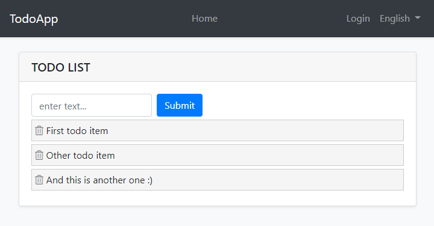
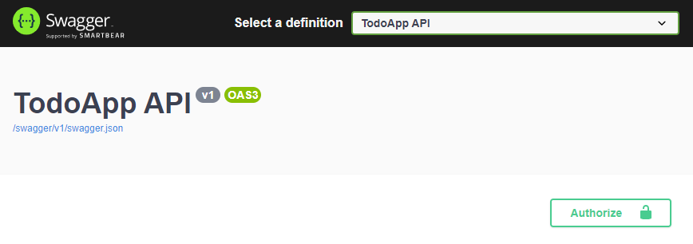
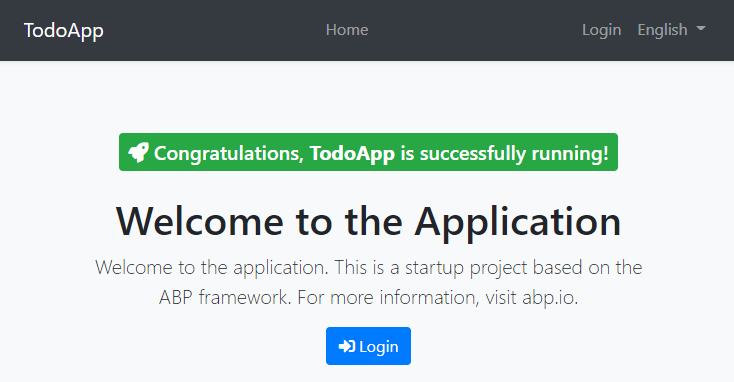
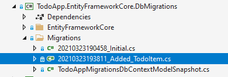
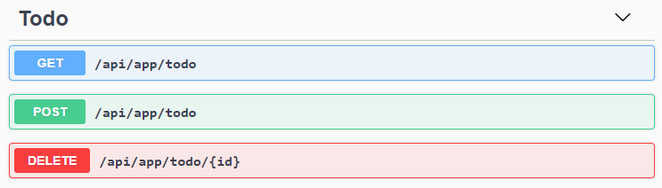
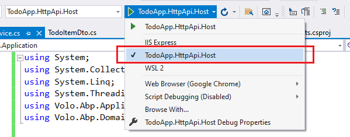

# Быстрое начало

````json
//[doc-params]
{
    "UI": ["MVC", "Blazor", "BlazorServer", "NG"],
    "DB": ["EF", "Mongo"]
}
````

Это состоящее из одной части краткое руководство по созданию простого приложения с помощью ABP Framework. Вот скриншот из финального приложения :



Вы можете найти исходный код готового приложения [здесь](https://github.com/abpframework/abp-samples/tree/master/TodoApp).

## Предварительно требования 

* IDE (e.g. [Visual Studio](https://visualstudio.microsoft.com/vs/)) с поддержкой [.NET 5.0+](https://dotnet.microsoft.com/download/dotnet) (используется en интерфейс примечанье разработчика).

{{if DB=="Mongo"}}

* [MongoDB Server 4.0+](https://docs.mongodb.com/manual/administration/install-community/)

{{end}}

{{if UI=="NG"}}

* [Node v14.x](https://nodejs.org/)

{{end}}

## Создайте новое решение

Мы будем использовать [ABP CLI](../../CLI.md) для создания новых решений с помощью ABP Framework. Вы можете установить его, запустив следующую команду в терминале командной строки: 

````bash
dotnet tool install -g Volo.Abp.Cli
````

Создайте пустую папку, откройте терминал командной строки и выполните следующую команду в терминале:

````bash
abp new TodoApp{{if UI=="Blazor"}} -u blazor{{else if UI=="BlazorServer"}} -u blazor-server{{else if UI=="NG"}} -u angular{{end}}{{if DB=="Mongo"}} -d mongodb{{end}}
````

{{if UI=="NG"}}

Это создаст новое решение с именем *TodoApp* с папками `angular` и `aspnet-core`. Когда решение будет готово, откройте решение ASP.NET Core в своей любимой IDE. 

{{else}}

Это создаст новое решение с именем *TodoApp*. Когда решение будет готово, откройте его в своей любимой IDE.

{{end}}

### Создайте базу данных

Если вы используете Visual Studio, щелкните правой кнопкой мыши по проекту TodoApp.DbMigrator и выберите *Set as StartUp Project*, затем нажмите *Ctrl + F5*, чтобы запустить его без отладки. Он создаст исходную базу данных и заполнит ее исходными данными. 

{{if DB=="EF"}}

> Некоторые IDE (например Rider) могут иметь проблемы при первом запуске, поскольку *DbMigrator* добавляет начальную миграцию и повторно компилирует проект. В этом случае откройте терминал командной строки в папке проекта `.DbMigrator` и выполните команду `dotnet run`. 

{{end}}

### Запуск приложения

{{if UI=="MVC" || UI=="BlazorServer"}}

Перед запуском приложения. Убедитесь, что проект {{if UI == "BlazorServer"}} `TodoApp.Blazor` {{else}}` TodoApp.Web` {{end}} установлен как *StartUp Project*, затем запустите приложение (Ctrl + F5 в Visual Studio ), чтобы увидеть интерфейс приложения: 

{{else if UI=="Blazor"}}

Перед запуском приложения имейте ввиду. что данное решение состоит из двух основных приложений;

* `TodoApp.HttpApi.Host` хост для HTTP API (бекенд).
* `TodoApp.Blazor` Blazor WebAssembly application(Фронтенд).

Убедитесь, что проект `TodoApp.HttpApi.Host` является запускаемым проектом(установлен как *StartUp Project*), затем запустите приложение (Ctrl + F5 в Visual Studio), чтобы увидеть HTTP API на сервере при помощи [Swagger UI](https://swagger.io/tools/swagger-ui/):



Вы можете изучить и протестировать свой HTTP API с помощью этого пользовательского интерфейса. Теперь мы можем установить `TodoApp.Blazor` в качестве запускаемого проекта(*StartUp Project*) и запустить его, чтобы открыть основной пользовательский интерфейс приложения Blazor: 

{{else if UI=="NG"}}

It is good to run the application before starting the development. The solution has two main applications;

* `TodoApp.HttpApi.Host` хост для HTTP API (бекенд).
* `angular` каталог содержит приложение Angular.

Убедитесь, что проект `TodoApp.HttpApi.Host` является запускаемым проектом(установлен как *StartUp Project*), затем запустите приложение (Ctrl + F5 в Visual Studio), чтобы увидеть HTTP API на сервере при помощи [Swagger UI](https://swagger.io/tools/swagger-ui/):


Вы можете изучить и протестировать свой HTTP API с помощью этого пользовательского интерфейса. Если API функционирует работает, то мы можем запустить клиентское приложение Angular.

Сначала выполните следующую команду, чтобы установить пакеты NPM; 

````bash
npm install
````

Установка всех пакетов займет некоторое время. Затем вы можете запустить приложение, используя следующую команду:

````bash
npm start
````

Эта команда требует времени, но в конечном итоге приложение будет запущено и открыто в браузере по умолчанию: 

{{end}}



Вы можете нажать кнопку *Login*/*Войти* , для входа используйте `admin` как логин и `1q2w3E*` как пароль для входа в приложение.

Все готово. вы можете начинать кодинг!

## Слой домена 

Это приложение имеет одну [сущность](../../ Entities.md), и мы начинаем с ее создания. Создайте новый `TodoItem` TodoItem внутри проекта *TodoApp.Domain*: 

````csharp
using System;
using Volo.Abp.Domain.Entities;

namespace TodoApp
{
    public class TodoItem : BasicAggregateRoot<Guid>
    {
        public string Text { get; set; }
    }
}
````

`BasicAggregateRoot` - это один из простейших базовых классов для создания корневых сущностей, а `Guid` - это первичный ключ(`Id`) сущности. 

## Интеграция с базой данных 

{{if DB=="EF"}}

Следующим шагом является настройка конфигурации [Entity Framework Core](../../Entity-Framework-Core.md).

### Настройка мапинга базы данных

Откройте класс `TodoAppDbContext` находящийся в папке `EntityFrameworkCore` в проекте *TodoApp.EntityFrameworkCore* и добавьте в этот класс новое свойство `DbSet`: 

````csharp
public DbSet<TodoItem> TodoItems { get; set; }
````

Затем откройте класс `TodoAppDbContextModelCreatingExtensions` в той же папке и добавьте конфигурацию сопоставления для класса `TodoItem`, как показано ниже: 

````csharp
public static void ConfigureTodoApp(this ModelBuilder builder)
{
    Check.NotNull(builder, nameof(builder));

    builder.Entity<TodoItem>(b =>
    {
        b.ToTable("TodoItems");
    });
}
````

Мы замапили объект `TodoItem` с таблицей `TodoItems` в базе данных. 

### написание миграций для базы данных с использованием подхода Code First

Данное решение использует Entity Framework Core и подход [Code First Migrations](https://docs.microsoft.com/en-us/ef/core/managing-schemas/migrations). Поскольку мы уже создали маппинг нам необходимо создать миграцию и применить изменения к базе данных. 

откройте терминал в каталоге проекта *TodoApp.EntityFrameworkCore.DbMigrations* и выполните  следующую комманду:

````bash
dotnet ef migrations add Added_TodoItem
````

Это добавит в проект новый класс миграции: 



Вы можете применить изменения к базе данных, используя следующую команду в терминале: 

````bash
dotnet ef database update
````
примечание переводчика: данное поведение не удалось воспроизвести.

> Если вы используете Visual Studio, вы можете использовать команды `Add-Migration Added_TodoItem` и `Update-Database` в консоли *Package Manager Console (PMC)*. В этом случае убедитесь, что {{if UI == "MVC"}} `TodoApp.Web` {{else if UI ==" BlazorServer "}}` TodoApp.Blazor` {{else if UI == "Blazor" | | UI == "NG"}} `TodoApp.HttpApi.Host` {{end}} - это 
запускаемый проект(установлен как *StartUp Project*), а` TodoApp.EntityFrameworkCore.DbMigrations` - это *проект по умолчанию*(*Default Project*) в выпадающем списке PMC. 

{{else if DB=="Mongo"}}

Следующим шагом является настройка конфигурации [MongoDB](../../MongoDB.md). Откройте класс `TodoAppMongoDbContext` в папке `MongoDb` проекта *TodoApp.MongoDB* и внесите следующие изменения; 

1. Добавьте в класс новое свойство: 

````csharp
public IMongoCollection<TodoItem> TodoItems => Collection<TodoItem>();
````

2. Добавьте следующий код в метод `CreateModel`:

````csharp
modelBuilder.Entity<TodoItem>(b =>
{
    b.CollectionName = "TodoItems";
});
````

{{end}}

Теперь мы можем использовать репозитории ABP для сохранения и извлечения элементов списка дел, как мы это сделаем в следующем разделе. 

## Слой Приложения

[Application Service](../../Application-Services.md) используется для выполнения высокоуровневых инитрукций приложения. Нам необходимо выполнить следующие варианты использования; 

* Получить список задач
* Создать новую задачу
* Удалить существующий элемент todo 

### Интерфейс(Interface) службы приложений 

Мы можем начать с определения интерфейса для службы приложения. Создайте новый интерфейс `ITodoAppService` в проекте *TodoApp.Application.Contracts*, как показано ниже: 

````csharp
using System;
using System.Collections.Generic;
using System.Threading.Tasks;
using Volo.Abp.Application.Services;

namespace TodoApp
{
    public interface ITodoAppService : IApplicationService
    {
        Task<List<TodoItemDto>> GetListAsync();
        Task<TodoItemDto> CreateAsync(string text);
        Task DeleteAsync(Guid id);
    }
}
````

### Data Transfer Object (Паттерн DTO.)

Методы `GetListAsync` и `CreateAsync` возвращают `TodoItemDto`. Службы приложений обычно получают и возвращают DTO ([Data Transfer Objects](../../Data-Transfer-Objects.md)) вместо сущностей. Итак, мы должны определить здесь класс DTO. Создайте новый класс `TodoItemDto` внутри проекта *TodoApp.Application.Contracts*: 


````csharp
using System;

namespace TodoApp
{
    public class TodoItemDto
    {
        public Guid Id { get; set; }
        public string Text { get; set; }
    }
}
````

Это очень простой класс DTO, соответствующий нашей сущности TodoItem. Мы готовы имплементировать `ITodoAppService`. 

### Имплементация Application Service

Создайте класс `TodoAppService` внутри проекта *TodoApp.Application*, как показано ниже: 

````csharp
using System;
using System.Collections.Generic;
using System.Linq;
using System.Threading.Tasks;
using Volo.Abp.Application.Services;
using Volo.Abp.Domain.Repositories;

namespace TodoApp
{
    public class TodoAppService : ApplicationService, ITodoAppService
    {
        private readonly IRepository<TodoItem, Guid> _todoItemRepository;

        public TodoAppService(IRepository<TodoItem, Guid> todoItemRepository)
        {
            _todoItemRepository = todoItemRepository;
        }
        
        // TODO: Implement the methods here...
    }
}
````

Этот класс наследуется от класса `ApplicationService` платформы ABP и реализует `ITodoAppService`, который был определен ранее. ABP предоставляет стандартные операции для для объектов [repositories](../../Repositories.md). Мы можем использовать их для выполнения основных операций с базой данных. Этот класс [injects](../../Dependency-Injection.md) `IRepository<TodoItem, Guid>`, который является репозиторием по умолчанию для объекта `TodoItem`. Мы будем использовать его для реализации описанных ранее сценариев использования. 

#### Получение записей TodoItem

Давайте имплементируем метод `GetListAsync`:

````csharp
public async Task<List<TodoItemDto>> GetListAsync()
{
    var items = await _todoItemRepository.GetListAsync();
    return items
        .Select(item => new TodoItemDto
        {
            Id = item.Id,
            Text = item.Text
        }).ToList();
}
````

Мы просто получаем полный список `TodoItem` из базы данных и маппим его на объект `TodoItemDto` и возвращаем как результат. 

#### Создание новой записи TodoItem

Следующий метод который мы имплементируем будет `CreateAsync` реализовать это, как показано ниже:

````csharp
public async Task<TodoItemDto> CreateAsync(string text)
{
    var todoItem = await _todoItemRepository.InsertAsync(
        new TodoItem {Text = text}
    );

    return new TodoItemDto
    {
        Id = todoItem.Id,
        Text = todoItem.Text
    };
}
````

Метод `InsertAsync` репозитория вставляет указанный объект `TodoItem` в базу данных и возвращает тот же объект `TodoItem`. Он также устанавливает `Id`, поэтому мы можем использовать его для возвращаемого объекта. Мы просто возвращаем `TodoItemDto`, создавая из нового объекта `TodoItem` 

#### Удаление записи Todo Item

Наконец, мы можем реализовать `DeleteAsync` как следующий блок кода: 

````csharp
public async Task DeleteAsync(Guid id)
{
    await _todoItemRepository.DeleteAsync(id);
}
````
 Application Service готова к использованию на уровне пользовательского интерфейса. 

## User Interface Layer

Пришло время показать задачи в пользовательском интерфейсе! Прежде чем приступить к написанию кода, было бы хорошо вспомнить, что мы пытаемся построить. Вот пример снимка экрана из окончательного пользовательского интерфейса: 


> **Мы сделаем часть пользовательского интерфейса минимальной для этого урока, чтобы сделать его простым и целенаправленным. См. [web application development tutorial](../Part-1.md) для создания реальных страниц со всеми аспектами.** 

{{if UI=="MVC"}}

### Index.cshtml.cs

Откройте файл `Index.cshtml.cs` в папке `Pages` проекта *TodoApp.Web* и замените содержимое следующим блоком кода: 

````csharp
using System.Collections.Generic;
using System.Threading.Tasks;

namespace TodoApp.Web.Pages
{
    public class IndexModel : TodoAppPageModel
    {
        public List<TodoItemDto> TodoItems { get; set; }

        private readonly ITodoAppService _todoAppService;

        public IndexModel(ITodoAppService todoAppService)
        {
            _todoAppService = todoAppService;
        }

        public async Task OnGetAsync()
        {
            TodoItems = await _todoAppService.GetListAsync();
        }
    }
}
````

Этот класс использует `ITodoAppService` для получения списка задач и назначения свойства `TodoItems`. Мы будем использовать его для рендеринга задач на странице razor. 
This class uses the `ITodoAppService` to get the list of todo items and assign the the `TodoItems` property. We will use it to render the todo items on the razor page.

### Index.cshtml

Open the `Index.cshtml` file in the `Pages` folder of the *TodoApp.Web* project and replace with the following content:

````xml
@page
@model TodoApp.Web.Pages.IndexModel
@section styles {
    <abp-style src="/Pages/Index.css" />
}
@section scripts {
    <abp-script src="/Pages/Index.js" />
}
<div class="container">
    <abp-card>
        <abp-card-header>
            <abp-card-title>
                TODO LIST
            </abp-card-title>
        </abp-card-header>
        <abp-card-body>            
            <!-- FORM FOR NEW TODO ITEMS -->
            <form id="NewItemForm" class="form-inline">
                <input id="NewItemText" 
                       type="text" 
                       class="form-control mr-2" 
                       placeholder="enter text...">
                <button type="submit" class="btn btn-primary">Submit</button>
            </form>
            
            <!-- TODO ITEMS LIST -->
            <ul id="TodoList">
                @foreach (var todoItem in Model.TodoItems)
                {
                    <li data-id="@todoItem.Id">
                        <i class="fa fa-trash-o"></i> @todoItem.Text
                    </li>
                }
            </ul>
        </abp-card-body>
    </abp-card>
</div>
````
Мы используем [card tag helper](../../UI/AspNetCore/Tag-Helpers/Cards.md) для создания простого представления карточек. Вы можете напрямую использовать стандартную структуру начального HTML, однако ABP [tag helpers]() значительно упрощают эту задачу и делают ее безопасной.

Эта страница импортирует файлы CSS и JavaScript, поэтому мы также должны их создать. 

### Index.js

Откройте файл `Index.js` в папке `Pages` проекта *TodoApp.Web* и замените его следующим содержимым: 

````js
$(function () {
    
    // DELETING ITEMS /////////////////////////////////////////
    $('#TodoList').on('click', 'li i', function(){
        var $li = $(this).parent();
        var id = $li.attr('data-id');
        
        todoApp.todo.delete(id).then(function(){
            $li.remove();
            abp.notify.info('Deleted the todo item.');
        });
    });
    
    // CREATING NEW ITEMS /////////////////////////////////////
    $('#NewItemForm').submit(function(e){
        e.preventDefault();
        
        var todoText = $('#NewItemText').val();        
        todoApp.todo.create(todoText).then(function(result){
            $('<li data-id="' + result.id + '">')
                .html('<i class="fa fa-trash-o"></i> ' + result.text)
                .appendTo($('#TodoList'));
            $('#NewItemText').val('');
        });
    });
});
````
В первой части мы регистрируем событие, которое при клике по иконке корзины рядом с элементами списка задач, это дейчтвие удалит связанный элемент на сервере и отобразить уведомление в пользовательском интерфейсе. Кроме того удалит удаленный элемент из DOM, благодоря этому нам не нужно обновлять страницу.

Во второй части мы создаем новый элемент todo на сервере. Если это удается, мы манипулируем DOM, чтобы вставить новый элемент `<li>` в TODO LIST. Таким образом, нет необходимости обновлять всю страницу после создания нового элемента todo.

Самое интересное здесь то, как мы общаемся с сервером. См. Раздел *Dynamic JavaScript Proxies & Auto API Controllers*, чтобы понять, как это работает. А теперь продолжим и заполним заявку. 

### Index.css

В качестве последнего штриха откройте файл `Index.css` в папке `Pages` проекта *TodoApp.Web* и замените его следующим содержимым: 

````css
#TodoList{
    list-style: none;
    margin: 0;
    padding: 0;
}

#TodoList li {
    padding: 5px;
    margin: 5px 0px;
    border: 1px solid #cccccc;
    background-color: #f5f5f5;
}

#TodoList li i
{
    opacity: 0.5;
}

#TodoList li i:hover
{
    opacity: 1;
    color: #ff0000;
    cursor: pointer;
}
````

Это простая стилизация страницы задач. Мы уверены, что у вас получится намного лучше :)

Теперь вы можете снова запустить приложение, чтобы увидеть результат. 

### Dynamic JavaScript Proxies & Auto API Controllers

В файле `Index.js` мы использовали функции `todoApp.todo.delete(...)` и `todoApp.todo.create(...)` для связи с сервером. Эти функции динамически создаются ABP Framework благодаря системе [Dynamic JavaScript Client Proxy](../../UI/AspNetCore/Dynamic-JavaScript-Proxies.md). Они выполняют вызовы HTTP API на сервер и возвращают promise, поэтому вы можете зарегистрировать обратный вызов для функции `then`, как мы сделали выше. 

Однако вы можете спросить, что мы не создали никаких контроллеров API, так как же сервер обрабатывает эти запросы? Этот вопрос подводит нас к функции ABP Framework [Auto API Controller](../../API/Auto-API-Controllers.md). Он автоматически преобразует сервисы приложения в контроллеры API в соответствии с соглашениями. 

Если вы откроете [Swagger UI](https://swagger.io/tools/swagger-ui/), введя URL-адрес `/swagger` в своем приложении, вы увидите Todo API: 



{{else if UI=="Blazor" || UI=="BlazorServer"}}

### Index.razor.cs

Откройте файл `Index.razor.cs` в папке `Pages` проекта *TodoApp.Blazor* и замените содержимое следующим блоком кода: 

````csharp
using Microsoft.AspNetCore.Components;
using System.Collections.Generic;
using System.Threading.Tasks;

namespace TodoApp.Blazor.Pages
{
    public partial class Index
    {
        [Inject]
        private ITodoAppService TodoAppService { get; set; }

        private List<TodoItemDto> TodoItems { get; set; } = new List<TodoItemDto>();
        private string NewTodoText { get; set; }

        protected async override Task OnInitializedAsync()
        {
            TodoItems = await TodoAppService.GetListAsync();
        }
        
        private async Task Create()
        {
            var result = await TodoAppService.CreateAsync(NewTodoText);
            TodoItems.Add(result);
            NewTodoText = null;
        }

        private async Task Delete(TodoItemDto todoItem)
        {
            await TodoAppService.DeleteAsync(todoItem.Id);
            await Notify.Info("Deleted the todo item.");
            TodoItems.Remove(todoItem);
        }
    }
}
````

Этот класс использует `ITodoAppService` для выполнения операций с элементами todo. Он модифицирует список `TodoItems` после операций создания и удаления. Таким образом, нам не нужно обновлять весь список задач с сервера. 

{{if UI=="Blazor"}}

См. Раздел *Dynamic C# Proxies & Auto API Controllers* ниже, чтобы узнать, как мы можем внедрить и использовать интерфейс службы приложения из приложения Blazor, запущенного в браузере! А теперь продолжим и заполним заявку. 

{{end # Blazor}}

### Index.razor

Откройте файл `Index.razor` в папке `Pages` проекта *TodoApp.Blazor* и замените содержимое следующим блоком кода: 

````xml
@page "/"
@inherits TodoAppComponentBase
<div class="container">
    <Card>
        <CardHeader>
            <CardTitle>
                TODO LIST
            </CardTitle>
        </CardHeader>
        <CardBody>
            <!-- FORM FOR NEW TODO ITEMS -->
            <form id="NewItemForm" 
                  @onsubmit:preventDefault
                  @onsubmit="() => Create()"
                  class="form-inline">
                <input type="text" 
                       @bind-value="@NewTodoText"
                       class="form-control mr-2" 
                       placeholder="enter text...">
                <button type="submit" class="btn btn-primary">Submit</button>
            </form>

            <!-- TODO ITEMS LIST -->
            <ul id="TodoList">
                @foreach (var todoItem in TodoItems)
                {
                    <li data-id="@todoItem.Id">
                        <i class="far fa-trash-alt"
                           @onclick="() => Delete(todoItem)"
                           ></i> @todoItem.Text
                    </li>
                }
            </ul>
        </CardBody>
    </Card>
</div>
````

### Index.razor.css

В качестве финального штриха откройте файл `Index.razor.css` в папке` Pages` проекта *TodoApp.Web* и замените его следующим содержимым: 

````css
#TodoList{
    list-style: none;
    margin: 0;
    padding: 0;
}

#TodoList li {
    padding: 5px;
    margin: 5px 0px;
    border: 1px solid #cccccc;
    background-color: #f5f5f5;
}

#TodoList li i
{
    opacity: 0.5;
}

#TodoList li i:hover
{
    opacity: 1;
    color: #ff0000;
    cursor: pointer;
}
````

Это простая стилизация страницы задач. Мы уверены, что у вас получится намного лучше :)

Теперь вы можете снова запустить приложение, чтобы увидеть результат. 

{{if UI=="Blazor"}}

### Динамические C# прокси и автоматические контроллеры API 

В файл `Index.razor.cs` мы внедрили (с атрибутом `[Inject]`) и использовали `ITodoAppService` точно так же, как при использовании локальной службы. Помните, что приложение Blazor работает в браузере, в то время как реализация этой службы приложения выполняется на сервере. 

Вся магия творится в системе [Dynamic C# Client Proxy](../../API/Dynamic-CSharp-API-Clients.md) платформы ABP. Он использует стандартный HttpClient и выполняет запросы HTTP API к удаленному серверу. Он также берет на себя все стандартные задачи, включая авторизацию, сериализацию JSON и обработку исключений. 

Однако вы можете спросить, что мы не создали никаких контроллеров API, так как же сервер обрабатывает эти запросы? Этот вопрос подводит нас к функции ABP Framework [Auto API Controller](../../API/Auto-API-Controllers.md). Он автоматически преобразует сервисы приложения в контроллеры API в соответствии с соглашениями. 

Если вы запустите приложение `TodoApp.HttpApi.Host`, вы увидите Todo API: 


{{end # Blazor}}

{{else if UI=="NG"}}

### Создание сервисного прокси 

ABP предоставляет удобную фичу автоматического создания клиентских сервисов, котороя позволяет легко использовать HTTP API, предоставляемые сервером. 

Сначала вам нужно запустить проект `TodoApp.HttpApi.Host`, поскольку генератор прокси считывает определения API из серверного приложения. 

> **Предупреждение**: имеется проблема с IIS Express; он не позволяет подключиться к приложению из другого процесса. Если вы используете Visual Studio, выберите `TodoApp.HttpApi.Host` вместо IIS Express в раскрывающемся списке кнопки запуска, как показано на рисунке ниже: 



После запуска проекта `TodoApp.HttpApi.Host` откройте терминал в папке `angular` и ввыполните следующую команду: 

````bash
abp generate-proxy
````

Если все пойдет хорошо, он должен сгенерировать вывод, как показано ниже: 

````bash
CREATE src/app/proxy/generate-proxy.json (170978 bytes)
CREATE src/app/proxy/README.md (1000 bytes)
CREATE src/app/proxy/todo.service.ts (794 bytes)
CREATE src/app/proxy/models.ts (66 bytes)
CREATE src/app/proxy/index.ts (58 bytes)
````

Затем мы можем использовать `todoService` для использования серверных HTTP API, как мы это сделаем в следующем разделе. 

### home.component.ts

Откройте файл `/angular/src/app/home/home.component.ts` и замените его содержимое следующим блоком кода: 

````js
import { ToasterService } from '@abp/ng.theme.shared';
import { Component, OnInit } from '@angular/core';
import { TodoItemDto, TodoService } from '@proxy';

@Component({
  selector: 'app-home',
  templateUrl: './home.component.html',
  styleUrls: ['./home.component.scss']
})
export class HomeComponent implements OnInit {

  todoItems: TodoItemDto[];
  newTodoText: string;

  constructor(
      private todoService: TodoService,
      private toasterService: ToasterService)
  { }

  ngOnInit(): void {
    this.todoService.getList().subscribe(response => {
      this.todoItems = response;
    });
  }
  
  create(): void{
    this.todoService.create(this.newTodoText).subscribe((result) => {
      this.todoItems = this.todoItems.concat(result);
      this.newTodoText = null;
    });
  }

  delete(id: string): void {
    this.todoService.delete(id).subscribe(() => {
      this.todoItems = this.todoItems.filter(item => item.id !== id);
      this.toasterService.info('Deleted the todo item.');
    });
  }  
}

````

Мы использовали `todoService` для получения списка todoItems и присвоили возвращаемое значение массиву `todoItems`. Мы также добавили методы `create` и `delete`. Эти методы будут использоваться на стороне клиента. 

### home.component.html

Откройте файл `/angular/src/app/home/home.component.html` и замените его содержимое следующим блоком кода: 

````html
<div class="container">
  <div class="card">
    <div class="card-header">
      <div class="card-title">TODO LIST</div>
    </div>
    <div class="card-body">
      <!-- FORM FOR NEW TODO ITEMS -->
      <form class="form-inline" (ngSubmit)="create()">
        <input
          name="NewTodoText"
          type="text"
          [(ngModel)]="newTodoText"
          class="form-control mr-2"
          placeholder="enter text..."
        />
        <button type="submit" class="btn btn-primary">Submit</button>
      </form>

      <!-- TODO ITEMS LIST -->
      <ul id="TodoList">
        <li *ngFor="let todoItem of todoItems">
          <i class="fa fa-trash-o" (click)="delete(todoItem.id)"></i> 
        </li>
      </ul>
    </div>
  </div>
</div>
````

### home.component.scss

В качестве финального штриха откройте файл `/angular/src/app/home/home.component.scss` и замените его следующим содержимым: 

````css
#TodoList{
    list-style: none;
    margin: 0;
    padding: 0;
}

#TodoList li {
    padding: 5px;
    margin: 5px 0px;
    border: 1px solid #cccccc;
    background-color: #f5f5f5;
}

#TodoList li i
{
    opacity: 0.5;
}

#TodoList li i:hover
{
    opacity: 1;
    color: #ff0000;
    cursor: pointer;
}
````

Это простая стилизация страницы задач. Мы уверены, что у вас получится намного лучше :)

Теперь вы можете снова запустить приложение, чтобы увидеть результат. 

{{end}}

## Заключение 

В этом руководстве мы создали очень простое приложение для знакомства с ABP Framework. Если вы хотите создать серьезное приложение, ознакомьтесь с [web application development tutorial](../Part-1.md), которое охватывает все аспекты разработки реальных веб-приложений. 

## Исходный код 

Вы можете найти исходный код готового приложения [здесь](https://github.com/abpframework/abp-samples/tree/master/TodoApp).

## Смотри также

* [Web Application Development Tutorial](../Part-1.md)